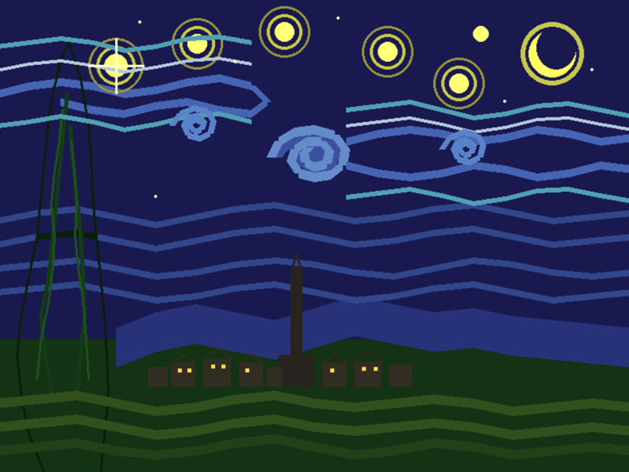
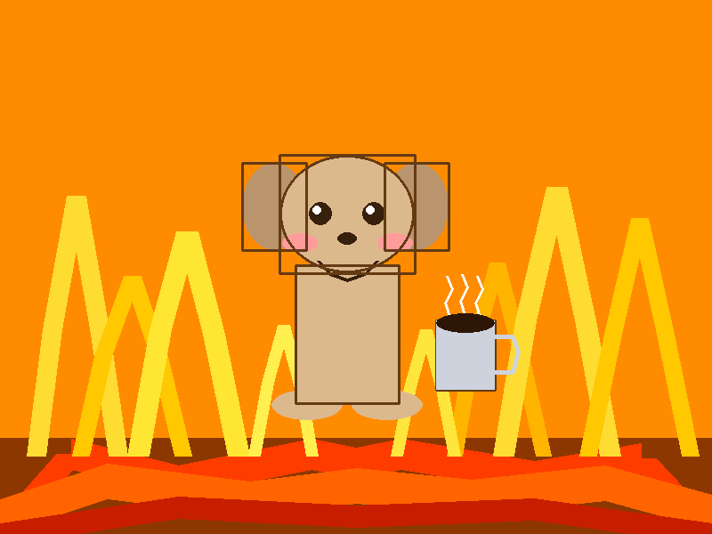
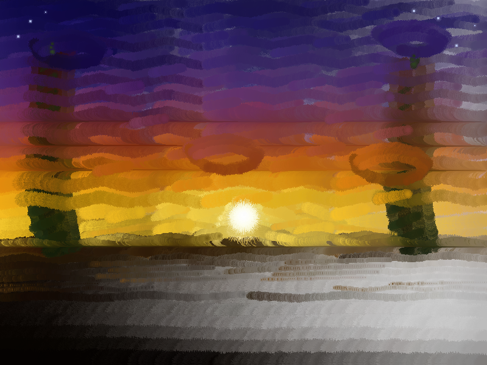

# Paint MCP

A drawing canvas exposed as an [MCP](https://modelcontextprotocol.io/) server. An LLM connects over stdio and paints on a pygame window using tool calls.

## Setup

```bash
pip install -r requirements.txt
```

## Usage

```bash
python server.py
```

This opens an 800x600 pygame canvas and starts the MCP server on stdio. Connect any MCP-compatible client (e.g. Claude Desktop) to the process.

## MCP Tools

| Tool | Description |
|---|---|
| `get_canvas_info` | Get canvas dimensions, current color, brush size, and mode |
| `set_color` | Set drawing color (RGB 0-255) |
| `set_brush_size` | Set brush size (1-50 px) |
| `draw_point` | Draw a single dot |
| `draw_line` | Draw a line between two points |
| `draw_rect` | Draw a rectangle (blocked in oil paint mode) |
| `draw_ellipse` | Draw an ellipse (blocked in oil paint mode) |
| `draw_path` | Draw a freehand path through coordinate pairs |
| `batch_strokes` | Execute many strokes in one call with per-stroke color/size overrides |
| `blend_path` | Smudge/blend existing colors along a path |
| `flood_fill` | Bucket fill an area (blocked in oil paint mode) |
| `clear_canvas` | Clear to white |
| `undo` | Undo last operation |
| `get_canvas_pixels` | Read pixel data from a region |
| `save_canvas` | Save canvas to a PNG file |

## Oil Paint Mode

| Tool | Description |
|---|---|
| `set_oil_paint_mode` | Toggle oil paint simulation on/off |
| `get_oil_painting_guide` | Get a technique guide for realistic oil painting |

When oil paint mode is enabled:

- **Color mixing** — the brush picks up existing canvas color as it moves, so overlapping strokes blend naturally.
- **Paint depletion** — strokes start opaque and gradually thin out as the brush runs dry. Each new stroke reloads the brush.
- **Soft edges** — dabs use concentric rings with cubic falloff for painterly texture.
- **Shapes disabled** — rectangles, ellipses, and flood fill are blocked. Only points, lines, and paths are available.
- **`batch_strokes`** is the recommended way to paint — send many short strokes per call, each with its own color and brush size.

## Examples

**Regular mode**

| Starry Night | Meme |
|:---:|:---:|
|  |  |

**Oil paint mode**

| Sunset | Alien Sunset |
|:---:|:---:|
|  |  |

## Architecture

- `server.py` — Entry point. Runs the pygame main loop and drains commands from a thread-safe queue.
- `tools.py` — MCP tool definitions. Pushes drawing commands onto the queue.
- `canvas.py` — Drawing engine. Wraps a pygame surface with draw ops, oil paint simulation, and an undo stack.
